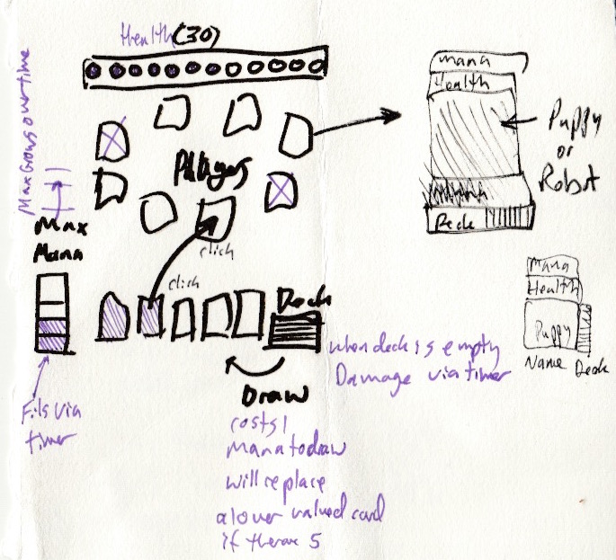

# Waypoint Crucible

Implementing
http://codingdojo.org/kata/TradingCardGame/

For
http://agnostechvalley.com/

## The Plan

Bring in some elements from earlier katas and experiments and try to flesh out a complete game

Elixir on the server side

Vue and SVG on the client side

Make it multiplayer

Add timing to the equation, anybody can attack anyone at any time, but 

1) drawing a card takes one mana and limited by a timed interval
2) max mana accumulates over a timed interval
3) mana replentishes over a timed interval
4) if a deck is empty, damage is done via a timer
5) if you have 5 cards drawing another card automatically replaces the lowest card you have

Make it space combat, kind of a "Faster Than Light" clone, but with fleet combat and weapons from stars for the cards.

## A Sketch

The story is that there is an errant WayPoint Jumpgate that sucks in everyone, only one can leave.

If there is time create bots

If there is time after that create a team play scenario where dogs in space suits are under Admiral Hope
and robots are under General Scum.

The human players are the dogs and need to try to cooperate to defeat the ai bots which might have personalities or strategies or both. (A personality might be how frequently you change your strategy (or to what) based on how frustrated you are or by other semi-arbitrary things such as a lack of success or a sense of patterns, even smack talk?)

Possibly add shields, which would be in the form of a second button to draw from your deck, you can draw a mistle or a shield either way the number is the same but the card that results will be either offensive or defensive, the defensive shield would fade in strength after a certain timeout period, say a point per second.

## Possible Strategies
    
    1) Offensive
    2) Defensive
    3) Shift between offensive and defensive based on
        * The absolute state of play
        * Because of patterns in others play
        * To shift our own pattern of play by some strategy
    
## State
    crucible
      maxMana:10
      maxHealth:30
      startingDeck:20
      startingHand: 0 | 3
      maxCards:5
      manaGrowthRate: 1 per 3 seconds
      manaReplentishRate: 1 per 1 second
      drawRate: 1 per 1 second
      fireRate: 2 per 1 second
      bleedOutRate: 1 per 2 seconds
      shieldDecayRate: 1 per 1 second
    
    waypoint
      status: "preparing" | "playing" | "complete"
      timer: "0"
      commands: []
      events: []
      players: []
      inFlight: []
      trajectory: 4 seconds
    
    player
      maxMana:10
      maxHealth:30
      maxCards:5
      startingDeck:20
      mana:0
      health:30
      shields:0
      cards:[]
      deck:[]
      drawEnabled: true
      bleedingOut: false
      alive: true
    
    cards
      0 nerfball | paper bag
      1 old rounds | golf umbrella
      2 bb bolt | elephant hide
      3 mini bolt | turtle shell
      4 magnum pod | flack jacket
      5 angry man | rage deflector
      6 mega bolt | mega absorber
      7 neutrino driver | neutrino barrier
      8 phase torpedo | phase shield
      
## Commands
    draw mistle
    draw shield
    play card target
      
    
## Relevant References
    
[A book](https://pragprog.com/book/lhelph/functional-web-development-with-elixir-otp-and-phoenix)
[It's Source](https://pragprog.com/titles/lhelph/source_code)

    
[An article](http://theerlangelist.com/article/spawn_or_not)
[It's Repo](https://github.com/sasa1977/erlangelist/tree/dc7cd1d2c77e52fa0a3a90f269c0f4ca8cca908b/examples/blackjack)

    
[A Presentation](https://www.youtube.com/watch?v=xzY1C_O3gDk&index=6&list=PLE7tQUdRKcyaMEekS1T32hUw19UxzqBEo)
[It's Repo](https://github.com/JEG2/hanabi_umbrella#long-term-storage)

## To start:

  * Install dependencies with `mix deps.get`
  * Create and migrate the database with `mix ecto.create && mix ecto.migrate`
  * Install Node.js dependencies with `npm install`
  * Start Phoenix endpoint with `mix phoenix.server`

Visit [`localhost:4000`](http://localhost:4000) from your browser.

